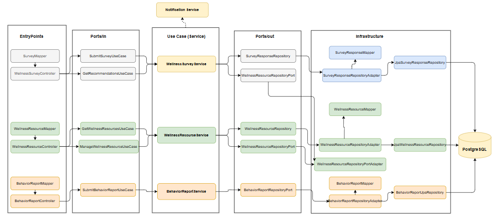
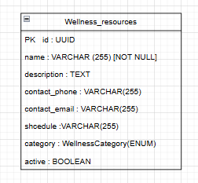
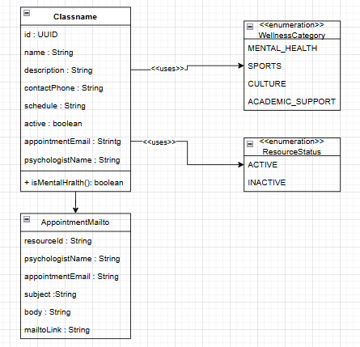
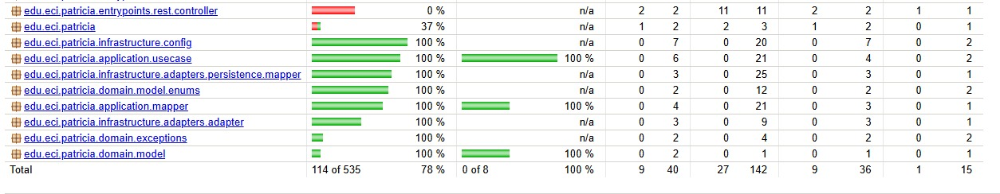

<div align="center">

# 🌿 DOSW — Microservicio de Bienestar y Soporte

---

### 🛠️ Stack Tecnológico


### ☁️ Infraestructura & Calidad


### 🏗️ Arquitectura


</div>

---

## 📑 Tabla de Contenidos

1. [👤 Integrantes](#1--integrantes)
2. [🎯 Objetivo del Microservicio](#2--objetivo-del-microservicio)
3. [⚡ Funcionalidades Principales](#3--funcionalidades-principales)
4. [📋 Estrategia de Versionamiento y Branches](#4--estrategia-de-versionamiento-y-branches)
5. [⚙️ Tecnologías Utilizadas](#5--tecnologías-utilizadas)
6. [🧩 Funcionalidad](#6--funcionalidad)
7. [📊 Diagrama de Componentes](#7--diagrama-de-componentes)
8. [⚠️ Manejo de Errores](#8--manejo-de-errores)
9. [🧪 Evidencia de Pruebas y Ejecución](#9--evidencia-de-pruebas-y-ejecución)
10. [🗂️ Organización del Código](#10--organización-del-código)
11. [🚀 Ejecución del Proyecto](#11--ejecución-del-proyecto)

---

## 1. 👤 Integrantes

- Tomas Espitia Quiroga
- Sebastian Gonzalez Aranguren
- Camilo Cristancho
- Andres Pineda

---

## 2. 🎯 Objetivo del microservicio

El microservicio de **Bienestar y Soporte** tiene como objetivo centralizar el acceso de los estudiantes de la Escuela
Colombiana de Ingeniería Julio Garavito a todos los recursos institucionales de apoyo disponibles. Este servicio implementa
una **Sección de Bienestar** que permite consultar el directorio de servicios categorizados (salud mental, deportes, cultura y
apoyo académico) y genera de forma automática un enlace *mailto* pre-armado con los datos del estudiante para solicitar una cita
psicológica. Además, incluye un módulo de **Soporte** para el reporte de comportamiento inapropiado, acoso o contenido ofensivo.
Por otro lado, incorpora un **motor de afinidad social** para facilitar el encuentro entre estudiantes con intereses compatibles,
y un **sistema de recomendaciones adaptativas** que aprende de las preferencias del usuario para evitar que siempre se muestren las
mismas opciones, ofreciendo así una experiencia dinámica y personalizada.

---

## 3. ⚡ Funcionalidades principales


| Funcionalidad              | Descripción                                                                                                                                                                                                      |
|----------------------------|------------------------------------------------------------------------------------------------------------------------------------------------------------------------------------------------------------------|
| Directorio de Recursos     | Consulta todos los recursos institucionales activos con filtro opcional por categoría (MENTAL_HEALTH, SPORTS, CULTURE, ACADEMIC_SUPPORT).                                                                        |
| Reporte de Soporte         | Permite a los estudiantes reportar comportamientos inapropiados, acoso o contenido ofensivo.                                                                                                                     |
| Motor de Afinidad Social   | Facilita el encuentro entre estudiantes con intereses compatibles, sugiriendo posibles conexiones sociales dentro de la plataforma                                                                                                 |
|Sistema de Recomendaciones Adaptativas|Aprende de las preferencias y comportamiento del usuario para ofrecer contenido dinámico y personalizado, evitando que siempre se muestren las mismas opciones.|
| Cita Psicológica vía Mailto | Genera un enlace <code>mailto</code> pre-armado con asunto y cuerpo personalizados con el nombre del estudiante para solicitar una cita de salud mental. Solo disponible para recursos de categoría MENTAL_HEALTH. |
| Persistencia PostgreSQL    | Los recursos institucionales se almacenan en PostgreSQL y se pre-cargan al arranque vía DataLoader, evitando duplicados en reinicios.                                                                            |


---

## 4. 📋 Estrategia de Versionamiento y Branches

### Estrategia de Ramas (Git Flow)

#### `main`
- Rama **estable** con la versión final lista para demo/producción.
- Solo recibe merges desde `develop/*`.
- Rama **protegida**: PR obligatorio, aprobaciones requeridas, CI en verde.

#### `develop`
- Base de integración continua para nuevas funcionalidades.
- Recibe merges desde `feature/*`.

#### `feature/*`
- Desarrollo de una funcionalidad o refactor específico.
- **Base:** `develop`. **Cierre:** PR hacia `develop`.

### 4.1 Convenciones para commits

```
[tipo]: [descripción específica]

feat: agregar endpoint de cita psicológica mailto
fix: corregir handler genérico que tapaba errores de SpringDoc
docs: actualizar README con instrucciones de ejecución
test: agregar pruebas de WellnessControllerTest
```

---

## 5. ⚙️ Tecnologías Utilizadas

| **Tecnología**                | **Uso en el proyecto**                                                                                 |
|-------------------------------|--------------------------------------------------------------------------------------------------------|
| **Java 21**                   | Lenguaje de programación base del microservicio backend, con soporte a records, switch expressions y mejoras modernas. |
| **Spring Boot 3.3.0**         | Framework principal para el microservicio REST.                                                        |
| **Spring Web**                | Exposición de endpoints REST bajo (controladores HTTP) dentro de la arquitectura hexagonal.            |
| **Spring Security**           | Configuración de seguridad stateless; integración JWT.                                                 |
| **Spring Data JPA**           | Integración con PostgreSQL mediante el patrón Repository.                                              |
| **PostgreSQL 16**             | Base de datos relacional principal con tabla `wellness_resources`.                                     |
| **H2**                        | Base de datos en memoria exclusiva para el contexto de tests.                                          |
| **Maven**                     | Gestión de dependencias y automatización de builds.                                                    |
| **Lombok**                    | Reducción de codigo con `@Getter`, `@Builder`, `@RequiredArgsConstructor`.                             |
| **JUnit 5**                   | Framework de pruebas unitarias.                                                                        |
| **Mockito**                   | Simulación de dependencias en pruebas unitarias.                                                       |
| **JaCoCo**                    | Reporte de cobertura de código.                                                                        |
| **SonarQube**                 | Análisis estático de calidad y vulnerabilidades.                                                       |
| **Swagger (SpringDoc 2.6.0)** | Documentación interactiva de la API en `/swagger-ui/index.html`.                                       |
| Postman                       |Validación manual de peticiones y respuestas JSON de los endpoints (POST, GET, PATCH, DELETE).|
| Docker                        |Contenerización del microservicio con build multi-stage para despliegues aislados y consistentes.|
| Docker Compose                |Orquestación local de la aplicación y PostgreSQL para desarrollo y pruebas de integración.|

---

## 6. 🧩 Funcionalidad

---

### 1️⃣ Listar Recursos de Bienestar

Retorna todos los recursos institucionales activos. Si se indica `categoryFilter`, filtra por categoría.

**Endpoint:** `GET /api/v1/bienestar/recursos`

---

#### 📦 Parámetros de la solicitud

| 🏷️ Campo | 🗃️ Tipo | ⚠️ Restricciones | 📝 Descripción                                   |
|---|---|:---:|--------------------------------------------------|
| categoryFilter | Enum | Opcional (query param) | MENTAL_HEALTH, SPORTS, CULTURE, ACADEMIC_SUPPORT |
| X-User-Name | String | Opcional (header temporal) | Nombre del estudiante                            |

---

#### 📦 Estructura de la respuesta

| 🏷️ Campo | 🗃️ Tipo | 📝 Descripción |
|---|---|---|
| id | String | Identificador único del recurso |
| name | String | Nombre del servicio/recurso |
| description | String | Descripción del servicio |
| contactPhone | String | Teléfono de contacto |
| contactEmail | String | Correo de contacto general |
| schedule | String | Horarios de atención |
| category | Enum | Categoría del recurso |
| appointmentEmail | String | Correo de cita (solo MENTAL_HEALTH) |
| psychologistName | String | Nombre psicóloga (solo MENTAL_HEALTH) |

---

#### ✅ Happy Path

**Request:**
```
GET /api/v1/bienestar/recursos?categoryFilter=MENTAL_HEALTH
```

**Response (200 OK):**
```json
[
  {
    "id": "1",
    "name": "Servicio de Psicología",
    "description": "Apoyo psicológico individual para estudiantes.",
    "contactPhone": "3015678893",
    "contactEmail": "bienestar@escuelaing.edu.co",
    "schedule": "Lunes a viernes, 8:00 a.m. – 5:00 p.m.",
    "category": "MENTAL_HEALTH",
    "appointmentEmail": "psicologia@escuelaing.edu.co",
    "psychologistName": "Dra. Andrea Gómez"
  }
]
```

---

#### 📊 Errores manejados

| 🔢 HTTP | ⚠️ Escenario | 💬 Mensaje |
|:---:|:---|:---|
|  | Categoría inválida | `"Valor inválido para el parámetro 'categoryFilter'"` |
|  | Sin resultados para la categoría | Lista vacía `[]` |

---

### 2️⃣ Generar Enlace de Cita Psicológica (Mailto)

Genera un enlace `mailto` pre-armado con el nombre del estudiante para solicitar una cita con la psicóloga institucional.

**Endpoint:** `GET /api/v1/bienestar/recursos/{id}/cita-mailto`

> ⚠️ **Solo disponible para recursos de categoría `MENTAL_HEALTH`.** Para cualquier otra categoría retorna `400 Bad Request`.

---

#### 📦 Parámetros de la solicitud

| 🏷️ Campo | 🗃️ Tipo | ⚠️ Restricciones | 📝 Descripción |
|---|---|:---:|---|
| id | String | Obligatorio (path) | ID del recurso de categoría MENTAL_HEALTH |
| X-User-Name | String | Obligatorio (header) | Nombre del estudiante para personalizar el mailto |

---

#### 📦 Estructura de la respuesta

| 🏷️ Campo | 🗃️ Tipo | 📝 Descripción |
|---|---|---|
| resourceId | String | ID del recurso |
| psychologistName | String | Nombre de la psicóloga |
| appointmentEmail | String | Correo destino de la cita |
| subject | String | Asunto pre-armado con el nombre del estudiante |
| body | String | Cuerpo pre-armado con saludo personalizado |
| mailtoLink | String | Enlace mailto listo para abrir en cliente de correo |

---

#### ✅ Happy Path

**Request:**
```
GET /api/v1/bienestar/recursos/1/cita-mailto
Headers: X-User-Name: Laura González
```

**Response (200 OK):**
```json
{
  "resourceId": "1",
  "psychologistName": "Dra. Andrea Gómez",
  "appointmentEmail": "psicologia@escuelaing.edu.co",
  "subject": "Solicitud de cita - Laura González",
  "body": "Quiero ajendar una cita etc...",
  "mailtoLink": "mailto:psicologia@escuelaing.edu.co  subject=Solicitud cita=Laura Gonzalez body=..."
}
```

---

#### 📊 Errores manejados

| 🔢 HTTP | ⚠️ Escenario | 💬 Mensaje |
|:---:|:---|:---|
|  | Recurso no es MENTAL_HEALTH | `"El recurso con id X no es de categoría MENTAL_HEALTH"` |
|  | Recurso no encontrado | `"No se encontró el recurso de bienestar con id: X"` |

---

### 🗄️ Recursos precargados en la BD

| ID | Nombre | Categoría |
|:---:|:---|:---:|
| 1 | Servicio de Psicología | MENTAL_HEALTH |
| 2 | Canchas de Fútbol | SPORTS |
| 5 | Grupo de Teatro ECI | CULTURE |
| 6 | Banda Musical Institucional | CULTURE |
| 7 | Tutorías Académicas | ACADEMIC_SUPPORT |

---

## 7. 📊 Diagrama

### Diagrama de componentes - Vista General
```
///////////////////////
```
### Diagrama de Componentes - Vista Especifica


**Arquitectura Hexagonal:**

| 🎨 Capa | 📋 Responsabilidad | 🔗 Dependencias |
|:---|:---|:---|
| **Domain** | Modelos, puertos, excepciones — lógica pura sin frameworks | ❌ Ninguna |
| **Application** | Casos de uso, DTOs, mapper | ✅ Solo Domain |
| **Entrypoints** | Controller REST + GlobalExceptionHandler | ✅ Domain + Application |
| **Infrastructure** | Adapter JPA, entidades, config, DataLoader | ✅ Domain + Application |


### Diagrama de base de datos



### Diagrama de Clases del Dominio



### Diagrama de Despliegue

///////////////////////
---

## 8. ⚠️ Manejo de Errores

El microservicio implementa un `GlobalExceptionHandler` con `@RestControllerAdvice` que centraliza todas las excepciones y retorna respuestas JSON estandarizadas.

### Global Exeption Handler

Se encarga de capturar y manejar todas la excepciones del sistema de una forma centralizada, para procesar cada tipo de error.

- ✅ **Centraliza** la captura de excepciones desde todos los controladores
- ✅ **Retorna mensajes JSON consistentes** con el mismo formato estructurado
- ✅ **Asigna códigos HTTP** según la naturaleza del error (400, 403, 404, 409, 500)
- ✅ **Define mensajes descriptivos** que ayudan tanto al desarrollador como al usuario
- ✅ **Mantiene la aplicación limpia**, eliminando bloques try-catch redundantes
- ✅ **Mejora la trazabilidad** y facilita la depuración en entornos de prueba y producción

### Formato de error estándar

```json
{
  "timestamp": "2026-05-08T10:30:00",
  "status": 404,
  "error": "Not Found",
  "message": "No se encontró el recurso de bienestar con id: 99",
  "path": "/api/v1/bienestar/recursos/99/cita-mailto"
}
```

### Excepciones manejadas

| ⚠️ Excepción | 🔢 HTTP | 💬 Escenario                                                      |
|:---|:---:|:------------------------------------------------------------------|
| `ResourceNotFoundException` | 404 | El recurso solicitado no existe o está inactivo                   |
| `InvalidCategoryForMailtoException` | 400 | Se intenta generar mailto para un recurso que no es MENTAL_HEALTH |
| `MethodArgumentTypeMismatchException` | 400 | Valor inválido en el parámetro `categoryFilter`                   |
| `MethodArgumentNotValidException` | 400 | Violación de validaciones en el request                           |

> **Nota importante:** El handler **NO** captura `Exception.class` genérica de forma intencional. Hacerlo tapa errores internos de SpringDoc y hace que `/v3/api-docs` devuelva 500.

## Beneficios

| 🎯 **Beneficio** | 📋 **Descripción** |
|:-----------------|:-------------------|
| **🎯 Uniformidad** | Todas las respuestas de error tienen el mismo formato JSON estandarizado |
| **🔧 Mantenibilidad** | Agregar nuevas excepciones no requiere modificar cada controlador |
| **🔒 Seguridad** | Oculta los detalles internos del servidor y evita exponer trazas sensibles |
| **📍 Trazabilidad** | Cada error incluye el código HTTP y descripción del fallo |
| **🤝 Integración fluida** | Facilita la comunicación con frontend y herramientas como Postman/Swagger |
---

## 9. 🧪 Evidencia de Pruebas y Ejecución

### Tipos de pruebas implementadas

| 🧪 Tipo                 | 📋 Descripción                                                                                 | 🛠️ Herramientas  |
|:------------------------|:-----------------------------------------------------------------------------------------------|:------------------|
| **Pruebas Unitarias**   | Validan el funcionamiento aislado de casos de uso, controladores y lógica de dominio con mocks | JUnit 5 + Mockito |
| **DataLoader**          | Prueban carga inicial y que no duplica en reinicios                                            | JUnit 5 + Mockito |
| **Contexto Spring**     | Verifica que la app levanta correctamente con H2                                               | @SpringBootTest   |
| **Cobertura de Codigo** | Para medir el porcentaje de codigo que cubren las pruebas                                      | JaCoCo            |
### Suites de prueba

```
src/test/java/com/patricia/suport/
├── GetWellnessResourcesUseCaseImplTest.java    (3 casos)
├── GetAppointmentMailtoUseCaseImplTest.java    (3 casos)
├── WellnessResourceRepositoryAdapterTest.java  (5 casos)
├── WellnessResourcePersistenceMapperTest.java  (3 casos)
├── WellnessMapperTest.java                     (3 casos)
├── WellnessControllerTest.java                 (9 casos)
├── JwtTokenProviderTest.java                   (7 casos)
├── JwtAuthenticationFilterTest.java            (6 casos)
├── DataLoaderTest.java                         (6 casos)
└── PatriciaApplicationTests.java               (1 caso — context loads)
```

### Cómo ejecutar las pruebas

```bash
# Ejecutar todas las pruebas
mvn test

# Ejecutar una suite específica
mvn test -Dtest=WellnessControllerTest

# Generar reporte de cobertura JaCoCo
mvn clean verify

# Ver reporte HTML
target/site/jacoco/index.html
```

> El build falla automáticamente si la cobertura cae por debajo del **80%** (configurado en Jacoco `check`).

### Evidencia de ejecucion

1. Consola muestra pruebas ejecutadas exitosamente
   ///////////////////////////////
2. Reporte JaCoCo con cobertura de código
   
  


---

## 10. 🗂️ Organización del Código

```
eeveevoiding-responsibilities-suport/
│
├── src/
│   ├── main/
│   │   ├── java/edu/eci/patricia/
│   │   │   │
│   │   │   ├── application/                        # 🔵 CAPA DE APLICACIÓN
│   │   │   │   ├── dto/response/
│   │   │   │   │   ├── WellnessResourceResponse.java
│   │   │   │   │   └── AppointmentMailtoResponse.java
│   │   │   │   ├── mapper/
│   │   │   │   │   └── WellnessMapper.java
│   │   │   │   └── usecase/
│   │   │   │       ├── GetWellnessResourcesUseCaseImpl.java
│   │   │   │       └── GetAppointmentMailtoUseCaseImpl.java
│   │   │   │
│   │   │   ├── domain/                             # 🟢 CAPA DE DOMINIO
│   │   │   │   ├── exceptions/
│   │   │   │   │   ├── ResourceNotFoundException.java
│   │   │   │   │   └── InvalidCategoryForMailtoException.java
│   │   │   │   ├── model/
│   │   │   │   │   ├── WellnessResource.java
│   │   │   │   │   ├── AppointmentMailto.java
│   │   │   │   │   └── enums/WellnessCategory.java
│   │   │   │   └── ports/
│   │   │   │       ├── in/
│   │   │   │       │   ├── GetWellnessResourcesUseCase.java
│   │   │   │       │   └── GetAppointmentMailtoUseCase.java
│   │   │   │       └── out/
│   │   │   │           └── WellnessResourceRepository.java
│   │   │   │
│   │   │   ├── entrypoints/                        # 🟠 ENTRADA (DRIVING ADAPTERS)
│   │   │   │   ├── advice/
│   │   │   │   │   └── GlobalExceptionHandler.java
│   │   │   │   └── rest/controller/
│   │   │   │       └── WellnessController.java
│   │   │   │
│   │   │   └── infrastructure/                     # 🟠 INFRAESTRUCTURA
│   │   │       ├── adapters/
│   │   │       │   ├── adapter/
│   │   │       │   │   └── WellnessResourceRepositoryAdapter.java
│   │   │       │   └── persistence/
│   │   │       │       ├── entity/WellnessResourceEntity.java
│   │   │       │       ├── mapper/WellnessResourcePersistenceMapper.java
│   │   │       │       └── repository/JpaWellnessResourceRepository.java
│   │   │       ├── config/
│   │   │       │   ├── SecurityConfig.java
│   │   │       │   ├── OpenApiConfig.java
│   │   │       │   └── DataLoader.java
│   │   │       └── security/
│   │   │           ├── JwtTokenProvider.java
│   │   │           └── JwtAuthenticationFilter.java
│   │   │
│   │   └── resources/
│   │       └── application.properties
│   │
│   └── test/
│       ├── java/com/patricia/suport/
│       │   ├── GetWellnessResourcesUseCaseImplTest.java
│       │   ├── GetAppointmentMailtoUseCaseImplTest.java
│       │   ├── WellnessResourceRepositoryAdapterTest.java
│       │   ├── WellnessResourcePersistenceMapperTest.java
│       │   ├── WellnessMapperTest.java
│       │   ├── WellnessControllerTest.java
│       │   ├── JwtTokenProviderTest.java
│       │   ├── JwtAuthenticationFilterTest.java
│       │   ├── DataLoaderTest.java
│       │   └── PatriciaApplicationTests.java
│       └── resources/
│           └── application-test.properties
│
├── pom.xml
└── README.md
```

---

## 11. 🚀 Ejecución del Proyecto

### 📋 Prerrequisitos

- **Java 21**
- **Maven 3.9+**
- **Docker & Docker Compose** (para PostgreSQL local)

### 🛠️ Opción 1: Ejecución Local

```bash
# 1. Levantar PostgreSQL con Docker
docker run --name bienestar-db \
  -e POSTGRES_DB=bienestar_db \
  -e POSTGRES_USER=patricia \
  -e POSTGRES_PASSWORD=patricia123 \
  -p 5432:5432 -d postgres:16

# 2. Ejecutar la aplicación
mvn spring-boot:run
```

📍 **URL Local:** `http://localhost:8083`
📚 **Swagger UI:** `http://localhost:8083/swagger-ui/index.html`

### ⚙️ Variables de Entorno

| Variable | Valor por defecto | Descripción |
|:---|:---|:---|
| `SPRING_DATASOURCE_URL` | `jdbc:postgresql://localhost:5432/bienestar_db` | URL de conexión PostgreSQL |
| `SPRING_DATASOURCE_USERNAME` | `patricia` | Usuario PostgreSQL |
| `SPRING_DATASOURCE_PASSWORD` | `patricia123` | Contraseña PostgreSQL |
| `SERVER_PORT` | `8083` | Puerto del servidor |

---

<div align="center">

### 🏆 Equipo **eeveevoiding-responsibilities**


> 💡 **M10 — Bienestar y Soporte** es el microservicio encargado de conectar a los estudiantes
> de la ECI con los recursos de apoyo institucional disponibles, garantizando privacidad y acceso sencillo.

**🎓 Escuela Colombiana de Ingeniería Julio Garavito**

</div>
