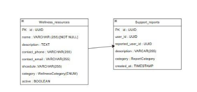
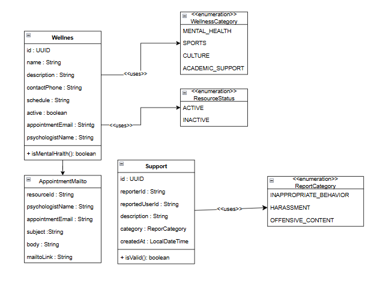
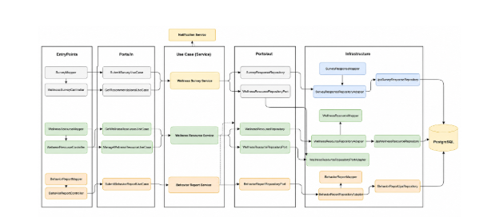
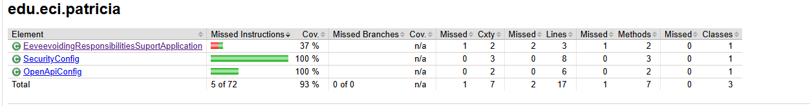

<div align="center">

# Bienestar Service (Support) — Microservicio de Bienestar y Soporte (M09)

### *"Momentos que inspiran, parches que unen."*

---

### Stack Tecnológico


### Infraestructura & Calidad


### Arquitectura


</div>

---

## Tabla de Contenidos

1. [Integrantes](#1-integrantes)
2. [Tecnologías Utilizadas](#2-tecnologías-utilizadas)
3. [Descripción del Microservicio](#3-descripción-del-microservicio)
4. [Cómo Funciona](#4-cómo-funciona)
5. [Diagrama de Datos](#5-diagrama-de-datos)
6. [Diagrama de Clases](#6-diagrama-de-clases)
7. [Diagrama de Componentes](#7-diagrama-de-componentes)
8. [Funcionalidades Principales](#8-funcionalidades-principales)
9. [Endpoints](#9-endpoints)
10. [Colas de Mensajería](#10-colas-de-mensajería)
11. [Evidencia de Pruebas](#11-evidencia-de-pruebas)
12. [Evidencia de Cobertura](#12-evidencia-de-cobertura)
13. [Cómo Ejecutar](#13-cómo-ejecutar)
14. [Evidencia CI/CD](#14-evidencia-cicd)
15. [Link Swagger](#15-link-swagger)
16. [Estructura del Código](#16-estructura-del-código)
17. [Código Documentado](#17-código-documentado)
18. [Conexiones Externas](#18-conexiones-externas)
19. [Pipeline de Desarrollo](#19-pipeline-de-desarrollo)
20. [Pipeline de Producción](#20-pipeline-de-producción)
21. [Dockerizado](#21-dockerizado)
22. [Versionamiento](#22-versionamiento)

---

## 1. Integrantes

- Tomas Espitia
- Juan Gonzalez
- Camilo Cristancho
- Andres Pineda

---

## 2. Tecnologías Utilizadas

| **Tecnología / Herramienta** | **Uso principal en el proyecto** |
|---|---|
| **Java 21 (OpenJDK)** | Lenguaje base con soporte para Spring Boot y Virtual Threads. |
| **Spring Boot 3.3.0** | Framework principal. Agrupa JPA, Security y Swagger. |
| **Spring Web** | Exposición de endpoints REST mediante los controladores `WellnessResourceController`, `WellnessSurveyController` y `BehaviorReportController`. |
| **Spring Security + JWT** | Protección de endpoints mediante token de sesión configurado con filtros personalizados y extracción de claims. |
| **Spring Data JPA** | Acceso a PostgreSQL, mapeando las entidades del dominio de bienestar. |
| **PostgreSQL 16** | BD relacional principal — almacena recursos, respuestas de cuestionarios y reportes de comportamiento. |
| **Apache Maven** | Gestión de dependencias y automatización de builds. |
| **Lombok 1.18.38** | Reducción de boilerplate con `@Getter`, `@Builder`, `@NoArgsConstructor`, `@AllArgsConstructor`. |
| **H2** | BD en memoria para pruebas unitarias y perfil dev rápido. |
| **JUnit 5 & Mockito** | Framework de pruebas unitarias y simulación de dependencias (Mocks). |
| **JaCoCo 0.8.13** | Análisis de cobertura de pruebas integrada en el ciclo de vida de Maven. |
| **SpringDoc OpenAPI 2.8.8** | Exposición dinámica del esquema de API y Swagger UI. |
| **Docker** | Contenedorización de la aplicación y base de datos local vía `docker-compose`. |

---

## 3. Descripción del Microservicio

El microservicio de **Bienestar y Soporte** (M09), conocido en el repositorio como `eeveevoiding-responsibilities-suport`, es el encargado de administrar herramientas institucionales enfocadas en la salud y el entorno positivo de la comunidad dentro de PATRIC.IA.

Sus responsabilidades principales cubren tres frentes:
1. **Gestión de Recursos (RF25):** Permite administrar contactos de bienestar, asesorías académicas y atención psicológica, facilitando el agendamiento de citas vía mail.
2. **Cuestionarios de Bienestar (RF23):** Los estudiantes pueden completar encuestas periódicas sobre su estado emocional o académico, recibiendo automáticamente recomendaciones basadas en su nivel de bienestar evaluado.
3. **Reportes de Comportamiento (RF24):** Sistema anónimo para denunciar conductas inapropiadas, asignando un número de caso único a cada incidente y protegiendo siempre la identidad del denunciante.

Puerto: `8080`. Integrado con **PostgreSQL**.

---

## 4. Cómo Funciona

### Arquitectura Hexagonal (Ports & Adapters) y Clean Architecture

```
┌─────────────────────────────────────────────────────┐
│                  EXTERIOR                           │
│  ┌──────────────┐         ┌──────────────────────┐  │
│  │  Controllers │         │  JPA Adapters        │  │
│  │  (REST)      │         │  (PostgreSQL)        │  │
│  │  Port In ──► │         │                      │  │
│  └──────┬───────┘         └────────────┬─────────┘  │
│         │          DOMINIO             │ ◄ Port Out  │
│         ▼   ┌────────────────────┐     │             │
│         └──►│  Use Cases /       │◄────┘             │
│             │  Domain Models     │                   │
│             └────────────────────┘                   │
└─────────────────────────────────────────────────────┘
```

El flujo está completamente aislado del framework:
1. Las peticiones entran por los `*Controller` en la capa *entrypoints*.
2. El controlador mapea el request a los Use Cases de *domain/ports/in*.
3. Los *Use Cases* (implementados en *application/service*) ejecutan lógica de negocio y se comunican con los puertos de salida (*domain/ports/out*).
4. La persistencia ocurre a través de los *adapters* en la capa *infrastructure*.

### Lógica de Dominio y Patrones de Diseño

| Patrón / Concepto | Ubicación | Descripción |
|---|---|---|
| **Ports & Adapters** | Toda la arquitectura | Interfaces claras (`In/Out`) para independizar el dominio. |
| **Value Object** | `MailtoAppointment`, `ResourceId` | Abstraen las validaciones de negocio de los tipos nativos (ej. metadatos para enviar correos estructurados). |
| **Factory Methods** | `WellnessResource` | Métodos semánticos (`createGeneral`, `createMentalHealth`) garantizan un estado consistente en la entidad sin usar constructores anémicos. |
| **Evaluación de Bienestar** | `WellnessSurveyService` | Algoritmo que promedia las respuestas de una escala de Likert (1-4) para asignar niveles (CRITICAL, LOW, MODERATE, HIGH, EXCELLENT). |

---

## 5. Diagrama de Datos


### Tabla: `Wellness_resources`
- **PK id**: `UUID`
- **name**: `VARCHAR(255) [NOT NULL]`
- **description**: `TEXT`
- **contact_phone**: `VARCHAR(255)`
- **contact_email**: `VARCHAR(255)`
- **shcedule**: `VARCHAR(255)`
- **category**: `WellnessCategory(ENUM)`
- **active**: `BOOLEAN`

### Tabla: `Support_reports`
- **PK id**: `UUID`
- **user_id**: `UUID`
- **reported_user_id**: `UUID`
- **description**: `VARCAR(255)`
- **category**: `ReportCategory`
- **created_at**: `TIMESTAMP`

*(Nota: En el modelo se observa una relación desde `Wellness_resources` hacia el campo `reported_user_id` de la tabla `Support_reports`)*

---

## 6. Diagrama de Clases


**Resumen del diseño de dominio:**

- **`Wellnes`**: Entidad principal que administra el recurso. Atributos: `id: UUID`, `name: String`, `description: String`, `contactPhone: String`, `schedule: String`, `active: boolean`, `appointmentEmail: Strintg`, `psychologistName: String`. Método: `+ isMentalHralth(): boolean`. Emplea los enumeradores `WellnessCategory` y `ResourceStatus`.
- **`AppointmentMailto`**: Objeto dependiente de `Wellnes` que encapsula metadatos para enviar correos de citas. Atributos: `resourceId: String`, `psychologistName: String`, `appointmentEmail: String`, `subject: String`, `body: String`, `mailtoLink: String`.
- **`Support`**: Entidad para el reporte de incidentes. Atributos: `id: UUID`, `reporterId: String`, `reportedUserId: String`, `description: String`, `category: ReporCategory`, `createdAt: LocalDateTime`. Método de validación `+ isValid(): boolean`. Emplea el enumerador `ReportCategory`.
- **Enumeradores Centrales**:
  - `WellnessCategory`: MENTAL_HEALTH, SPORTS, CULTURE, ACADEMIC_SUPPORT.
  - `ResourceStatus`: ACTIVE, INACTIVE.
  - `ReportCategory`: INAPPROPRIATE_BEHAVIOR, HARASSMENT, OFFENSIVE_CONTENT.

---

## 7. Diagrama de Componentes



**Resumen de la Arquitectura Hexagonal y Flujo de Componentes:**

El diagrama ilustra el flujo de los datos a través de las siguientes capas:

1. **EntryPoints (Controladores y Mappers):**
   - `WellnessSurveyController` interactúa con `SurveyMapper`.
   - `WellnessResourceController` interactúa con `WellnessResourceMapper`.
   - `BehaviorReportController` interactúa con `BehaviorReportMapper`.
2. **Ports/In (Puertos de Entrada):**
   - `SubmitSurveyUseCase` y `GetRecommendationsUseCase`.
   - `GetWellnessResourcesUseCase` y `ManageWellnessResourceUseCase`.
   - `SubmitBehaviorReportUseCase`.
3. **Use Case (Service):**
   - Lógica de negocio orquestada por: `Wellness Survey Service`, `Wellness Resource Service` y `Behavior Report Service`. *(El diagrama ilustra una posible integración superior con un `Notification Service` externo).*
4. **Ports/Out (Puertos de Salida):**
   - Interfaces de persistencia: `SurveyResponseRepository`, `WellnessResourceRepositoryPort`, `BehaviorReportRepositoryPort`.
5. **Infrastructure (Adaptadores y Spring Data):**
   - `SurveyResponseRepositoryAdapter` (usa `SurveyResponseMapper`) delega a `JpaSurveyResponseRepository`.
   - `WellnessResourceRepositoryAdapter` (usa `WellnessResourceMapper`) y `WellnessResourceRepositoryPortAdapter` delegan a `JpaWellnessResourceRepository`.
   - `BehaviorReportRepositoryAdapter` (usa `BehaviorReportMapper`) delega a `BehaviorReportJpaRepository`.
6. **Almacenamiento:**
   - Todos los repositorios JPA persisten y leen de la base de datos central **PostgreSQL**.

---

## 8. Funcionalidades Principales

<div align="center">

| ID | RF | Funcionalidad | Descripción |
|---|---|---|---|
| F01 | RF25 | **Gestión de Recursos (CRUD)** | Permite administrar contactos institucionales (psicología, monitorias). Incluye filtrado por categoría. |
| F02 | RF25 | **Citas de Salud Mental** | Generación dinámica de `mailto:` estructurado con "Asunto" y "Cuerpo" para la solicitud rápida de asesorías. |
| F03 | RF23 | **Cuestionario de Bienestar** | Exposición de una batería de 10 preguntas. El estudiante lo diligencia y el sistema pondera su nivel de bienestar. |
| F04 | RF23 | **Recomendaciones Automáticas** | A partir del resultado del cuestionario, el sistema sugiere recursos específicos de la BD afines a las necesidades detectadas. |
| F05 | RF24 | **Reportes de Comportamiento** | Creación de reportes anónimos. Genera un número de radicado y aísla la identidad del denunciante respecto de la parte acusada. |

</div>

---

## 9. Endpoints

### Resumen de Rutas Principales

| Dominio | Endpoint | Método | Funcionalidad |
|---|---|---|---|
| **Recursos** | `/api/v1/wellness/resources` | `GET`, `POST` | Listar y crear recursos de bienestar. |
| **Recursos** | `/api/v1/wellness/resources/{id}` | `GET`, `PUT`, `DELETE` | Operaciones puntuales sobre un recurso. |
| **Recursos** | `/api/v1/wellness/resources/{id}/cita-mailto` | `GET` | Generar el enlace `mailto:` pre-llenado. |
| **Cuestionarios** | `/api/v1/wellness/surveys/questions` | `GET` | Obtener las preguntas del cuestionario de 10 puntos. |
| **Cuestionarios** | `/api/v1/wellness/surveys/submit` | `POST` | Enviar las respuestas de la encuesta. |
| **Cuestionarios** | `/api/v1/wellness/surveys/my-results` | `GET` | Ver historial de resultados del usuario actual. |
| **Reportes** | `/api/v1/wellness/reports` | `POST` | Crear una denuncia de mal comportamiento. |
| **Reportes** | `/api/v1/wellness/reports/my-reports` | `GET` | Revisar el estado de las denuncias interpuestas. |

> **Autenticación:** Todos los endpoints exigen la inclusión de un JWT válido en la cabecera `Authorization: Bearer <token>`, del cual se extrae el ID del estudiante para aislar sus acciones.

---

## 10. Colas de Mensajería

En el alcance actual, el módulo se centra en persistencia relacional síncrona, sin la publicación o consumo activo a través de Kafka o RabbitMQ. Toda la información (encuestas y reportes) se consolida en la BD para eventual consumo por módulos estadísticos (M12) a demanda o a futuro.

---

## 11. Evidencia de Pruebas

El servicio tiene cobertura robusta a nivel de Dominio, Aplicación (Service layers), Controladores y Adaptadores JPA. 

```
src/test/java/edu/eci/patricia/
├── application/service/          # Testean la lógica de UseCases y mapeo
│   ├── BehaviorReportServiceTest.java
│   ├── WellnessResourceServiceTest.java
│   └── WellnessSurveyServiceTest.java
├── config/                       # Test de configuraciones y filtros
│   ├── JwtAuthFilterTest.java
│   └── SecurityConfigTest.java
├── domain/model/                 # Unit Tests de objetos inmutables y enums
│   └── WellnessResourceTest.java (y más...)
├── entrypoints/rest/             # Test MVC (WebMvcTest + MockMvc)
│   ├── BehaviorReportControllerTest.java
│   └── WellnessSurveyControllerTest.java
└── infrastructure/adapters/      # Test a la capa de persistencia 
```

### Comandos de Ejecución

```bash
# Ejecución general de pruebas
./mvnw test

# Pruebas + Generar reporte de JaCoCo
./mvnw clean test jacoco:report
```

---

## 12. Evidencia de Cobertura

Se espera y exige una cobertura general `>= 80%` a través de JaCoCo. La carpeta `infrastructure/config` y las clases `Dto` se han excluido estratégicamente del análisis al carecer de lógica propia.

<div align="center">

</div>

---

## 13. Cómo Ejecutar

### Prerrequisitos

- Java 21
- Maven 3.9+
- Docker & Docker Compose (Recomendado para BD)

### Opción 1: Desarrollo Local (Maven con H2 o BD Externa)

```bash
# Instalar dependencias y correr en el puerto 8080
./mvnw spring-boot:run
```

Si desea conectar localmente a un PostgreSQL configurado, deberá proveer las variables de entorno especificadas más abajo.

### Opción 2: Docker Compose (PostgreSQL Inyectado)

El repositorio cuenta con la receta para levantar inmediatamente la aplicación junto a su BD.

```bash
# Levantar servicios
docker compose up --build

# Bajar servicios
docker compose down -v
```

### Variables de Entorno Claves

| Variable | Descripción |
|---|---|
| `SPRING_DATASOURCE_URL` | URL de la BD (ej. `jdbc:postgresql://localhost:5432/m09_suport`) |
| `SPRING_DATASOURCE_USERNAME` | Usuario de PostgreSQL |
| `SPRING_DATASOURCE_PASSWORD` | Contraseña de PostgreSQL |
| `JWT_SECRET` | Secreto HS256 para validación del token de Spring Security |
| `PORT` | Puerto de exposición de la API (Defecto: `8080`) |

---

## 14. Evidencia CI/CD

El módulo posee integración con GitHub Actions para asegurar la calidad antes de aceptar cualquier pull request sobre `develop` o `main`.

<div align="center">


</div>

El flujo realiza:
1. **Compilación** vía Maven.
2. **Pruebas Unitarias** para evitar regresiones de lógica.
3. Validación de **Cobertura** con JaCoCo.
4. (Opcional en CD) **Docker Build & Push** a repositorio de artefactos.

---

## 15. Link Swagger

Una vez ejecutada la aplicación, la documentación interactiva provista por **SpringDoc OpenAPI** es accesible en:

| Entorno | URL |
|---|---|
| Interfaz Gráfica UI | [http://localhost:8080/swagger-ui.html](http://localhost:8080/swagger-ui.html) |
| Definición JSON | [http://localhost:8080/v3/api-docs](http://localhost:8080/v3/api-docs) |

*(Nota: Requiere autorizar el Bearer Token arriba a la derecha en Swagger para ejecutar llamados hacia los endpoints protegidos).*

---

## 16. Estructura del Código

Respetando `Ports & Adapters`:

```text
src/main/java/edu/eci/patricia/
├── application/                     # Lógica Orquestadora
│   ├── dto/                         # Request / Response inmutables
│   └── service/                     # Implementación Use Cases
├── config/                          # JWT, OpenAPI, Flyway
├── domain/                          # Entidades Core sin dependencias externas
│   ├── exception/
│   ├── model/
│   └── ports/                       # Interfaces in/out
├── entrypoints/                     # Capa Externa In (Web)
│   ├── rest/                        # Controladores HTTP y Advice
└── infrastructure/                  # Capa Externa Out (Persistencia)
    └── adapters/persistence/        # JPA Entities, Repositories, Mappers
```

---

## 17. Código Documentado

El código base incluye **JavaDocs** en las interfaces de dominio (`UseCase` y `Port`), y anotaciones en Swagger `@Operation` y `@ApiResponse` dentro de los `*Controller` para dejar en claro el propósito de los métodos sin necesidad de inspeccionar el código interno.

---

## 18. Conexiones Externas

| Módulo | Tipo | Dirección | Detalle |
|---|---|---|---|
| **M01 — Autenticación** | JWT (Offline) | M01 → M09 | M09 lee el token generado por M01 utilizando la llave compartida `JWT_SECRET` en el `JwtAuthFilter`. No hay peticiones HTTP constantes entre módulos. |

---

## 19. Pipeline de Desarrollo

1. Se parte de la rama `develop`.
2. Se crean ramas con el prefijo `feature/nombre` (o `feat/nombre`).
3. Se realizan commits atómicos bajo convención (ej. `feat: add behavior reports`).
4. La ejecución de `./mvnw test` debe ser verde localmente.
5. Se lanza Pull Request hacia `develop`, el pipeline de CI verifica que las pruebas y la cobertura estén en regla.

---

## 20. Pipeline de Producción

Los despliegues (vía Docker) toman la imagen producida en el pipeline de CD y la despliegan en el servicio Cloud (ej. AWS ECS, Azure, o clúster Docker Swarm). El uso de propiedades centralizadas facilita el pasaje a producción mediante `SPRING_PROFILES_ACTIVE=prod`.

---

## 21. Dockerizado

### Dockerfile

Basado en multistage-build para aligerar la imagen resultante:

```dockerfile
# Se ejecuta la compilación en Maven
FROM maven:3.9.6-eclipse-temurin-21 AS build
...
# Se copia únicamente el JAR final hacia el Runtime
FROM eclipse-temurin:21-jre-alpine
COPY --from=build /app/target/*.jar app.jar
EXPOSE 8080
ENTRYPOINT ["java", "-jar", "app.jar"]
```

---

## 22. Versionamiento

Uso estricto de **Git Flow**:

- `main`: Refleja el estado en producción. Únicamente modificado vía pull requests verificados desde `develop` o `hotfix`.
- `develop`: Rama base de desarrollo colectivo.
- `feat/*`: Para nuevas funcionalidades (como `feat/wellness`, rama base de la versión actual).
- Tags semánticos (`v1.0.0`, etc.) marcan los releases estables sobre `main`.
